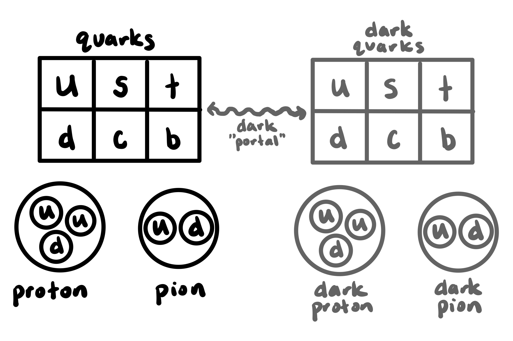
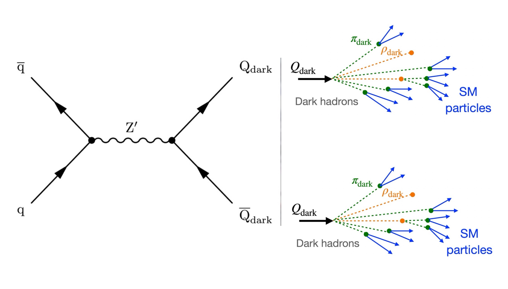
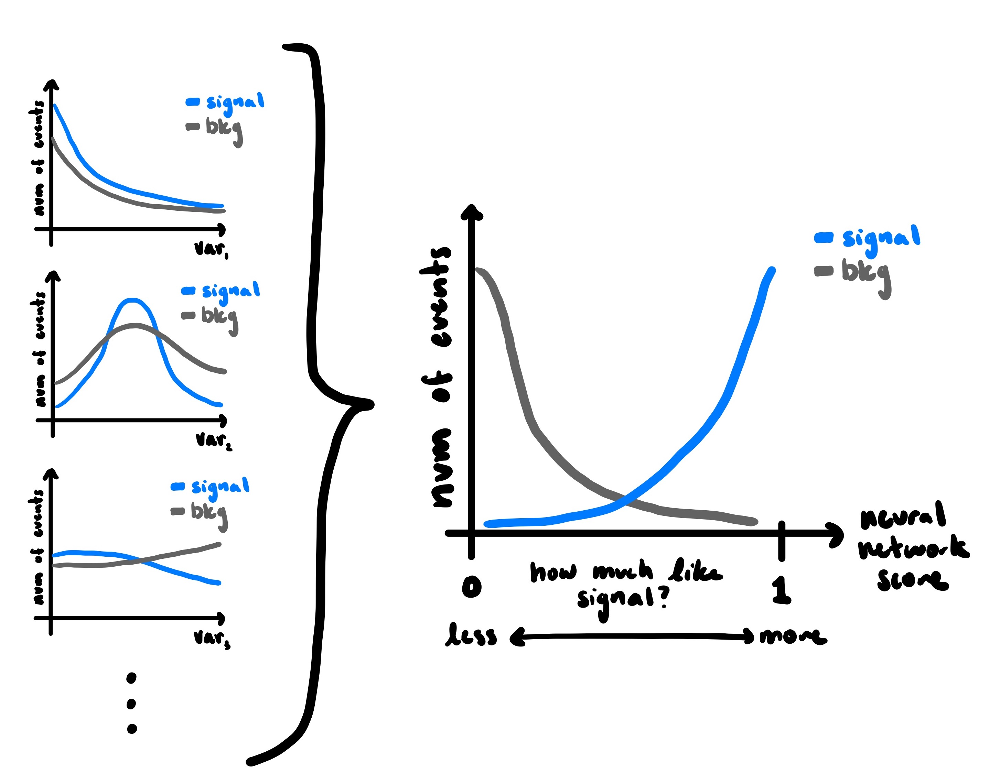

# My Analysis
## A Search for a Dark Matter Candidate with the CMS Experiment at the LHC

### A Note from Sam:
Hello friend. This section is of course going to get pretty technical. If you are interested in the details feel free to dive right in and absorb as much as possible. If you are more interested in the pretty pictures that is perfect too! 
The goal of this page is so when I show the real plots at my Preliminary Exam, Thesis Defense, or on a future paper (fingers crossed) you will recognize them! Per usual, please send me your questions and happy reading!

under development

We know the [Standard Model](../Physics101/ParticlePhysics.md) has a few missing pieces. One of the most interesting of which is **dark matter**. We don't yet know what dark matter is, but we do know a few things about it.
1. It has mass and thus experiences gravity
2. It is not electrically charged and does not interact with light
3. It is stable and long-lived

From these clues theorists can make guesses as to what dark matter might be. We experimentalists then can go searching through our collision data to try and find the theoretical particle.
Below I describe what this elusive search looks like at the [CMS Experiment](../Physics101/CMS.md).

## Step 0: The Theorists Tell Us Their Guess
One idea for dark matter is the existence of a "dark sector". This means that the Standard Model particles we know and love would have dark copies, not dissimilar to how Standard Model particles also have antiparticles. In this case instead of changing the charge of particles to make antiparticles, we change how the particle interacts to fit the predictions for dark matter as listed above. This kind of dark matter would occur if a Standard Model particle was allowed to "tunnel" to the dark sector through what is often called a "dark portal". 

This is all theoretical at this point, but it should feel a little similar. The same way that a muon can turn into an electron with the help of the W boson, a Standard Model up quark could turn into a dark up quark with the help of some other particle. These dark particles then would follow different rules than Standard Model particles. Most notably, these particles would not interact with our detector. So then how can we find them if they do exist? The portal will work both directions, which would allow the dark sector particles to turn back into Standard Model particles which we can then again see in our detector. 

So in our detector we would see something like the drawing below: some Standard Model quarks (q) would collide, tunnel to the dark sector with the help of the portal (called Z' in this case), and become dark quarks ($Q_dark$). These dark quarks would then hang out for some time as they travel along, and at some point in time they would tunnel back into Standard Model quarks shown in color.

These manifestations are called *Emerging Jets*. We will see Standard Model particles, a gap where they have become dark particles and we cannot see them, and then Standard Model particles again. These particles seem to "emerge" out of something invisible. This is what my analysis will be looking for. 

## Step 1: What Would The Particle Look Like?
In order to look for these Emerging Jets and thus these dark quarks, we need to model in great detail what they would look like inside of the CMS Detector. To do this we create computer simulations to model the particles inside our detector. We call this the signal. This is what we will go searching for. Everything else we call background. 

What something "looks like" in particle physics is described by its physical characteristics. These include things like its mass, its energy, its speed, its path, etc. The important part of the analysis is finding characteristics that look very particular to the signal we are looking for, and thus can distinguish it from the background. 

In order to "look" at the signal and the background we make histograms of each characteristic. It is the distributions we are interested in and what will help us describe and find the signal we are looking for.

Sometimes the distributions are very different, and sometimes they are very similar. If there are a few characteristics that are very distinguishing we can simply grab all events in a particular region, as we are confident most of them will be the signal we want. 
For example, maybe your signal has a mass that is only ever 125 while your background comes in a range of masses. Then you might make a plot of the mass of everything you see and the result would be something like this:

This is how the Higgs Boson (mass of 125GeV) was discovered at the LHC in 2012. 

So what do we know about our signal, emerging jets? 
- The emerging jet will be seen some distance away from the collision point
- The emerging jet will be made up of quarks
And honestly, that's kind of it...

That's not a lot to go on, so it's very hard to make a plot like the Higgs boson did. So instead we use a tool called a **Neural Network**. This tool takes in as many characteristics as we want, and instead of making simple cuts on characteristics (like restricting mass to be 125GeV, or that the jet occurs some distance away) it will instead learn from all of the characteristics at once! It will then output a score on a range from background-like (0) to signal-like (1). Then we can instead grab the region of this score where we are confident there is a lot of signal.

Here are a few examples of what these histograms of characteristics might look for signal and for background. Notice some distributions look very different between signal and background, and some look very similar. Then notice how different they look after the Neural Network has scored them! Thanks Neural Network! We can then grab every event that has a really high score as we are very confident that that event is our signal, aka an emerging jet. 

