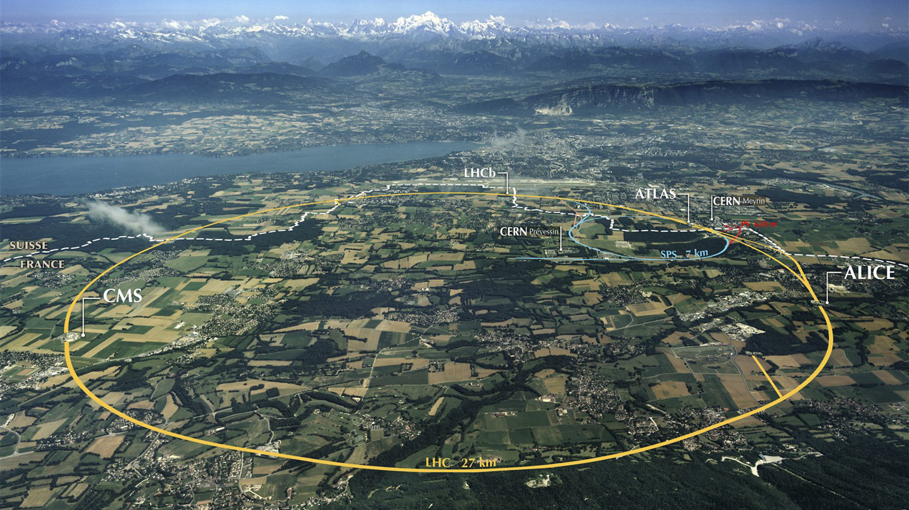

# The Large Hadron Collider
the motivation and technology behind the world's largest machine.

## What is the Large Hadron Collider?
The Large Hadron Collider (LHC) is a 27 kilometer circumference (17 miles for us Americans) circular particle collider that was build 100 meters underground in Geneva, Switzerland. The collider itself consists of a tube (shown at the top of this page) that contains two beam pipes. One of the beams of particles travels clockwise around the 27km ring, and at the same time the other travels counter-clockwise. They are then directed to collide at one of the four collision points. These collision points are where the magic happens!  

## Why Build the Large Hadron Collider?
We want to understand what the universe is made of! As discussed in the Particle Physics section, we have a very successful theory called the Standard Model. This describes all of the particles we have found and all of the characteristics we know about them. Things like their mass, their electric charge, how they interact with each other. But there are gaps. There are things we have observed in the universe that don't yet fit in the Standard Model, so we know it is incomplete. Two of the most famous examples of this are gravity and dark matter. 
We of course know that gravity exists, just try dropping that bowling ball on your foot and see if you agree, but we don't know how it fits into the Standard Model. Maybe it has its own particle called a graviton that someday will be added in. Some people at the LHC are looking for the graviton! Maybe gravity isn't a particle or a force at all and we need a new way to describe it. 
Another mystery is dark matter. In the 1960s and 70s an astronomer named Vera Rubin was modeling how fast different stars in the Milky Way should be orbiting the center of our galaxy. When she went and measured how fast stuff was actually moving it was too fast! This is because she was making her guess based off the mass we could see and knew was there. The only way to explain this is there is a lot of mass in the Milky Way that we cannot see, and we call this dark matter. 
We know that there is some kind of mass in our galaxy (and every other galaxy in the universe for that matter) that we can't see (it doesn't interact with light), but is definitely there. We know this because our galaxy is spinning too fast. And this is no small thing. Dark matter makes up about 90% of the mass of the Milky Way!

So how do we figure out what dark matter is?

We have two main ways to discover and study particles: finding ones the universe made, or making them ourselves. The LHC is a particle producing machine. So let's go over how it works.
The LHC takes protons off of Hydrogen gas (one proton and one electron) and makes a line of protons and accelerates them to 99% the speed of light using a system of magnets. These two proton beams then travel around the ring of the LHC until they are bumped off course just enough to collide into each other. At these collision points we have detectors to "see" what comes out of these collisions. The best of these experiments (totally unbiased) is CMS.
So what comes out of these collisions? ANYTHING! That's the exciting part!
The LHC has the ability to collide the quarks inside of the protons (remember protons are composite particles made of three quarks) in a way that completely annihilates them, which can produce just about any particle in the universe! Of course it has to follow a few rules, and you have to have enough speed to create the mass of the thing you want to come out (recall the discussion on turning kinetic energy into mass in the introduction to particle physics). So by getting these particles moving fast enough and colliding them we can create just about any particle in the universe. This is the test bench for discovering new particles!

So what kind of things can we study? Take a look at the [CMS](Physics101/CMS.md) page to see what kind of searches we are doing with these collisions at the LHC.
