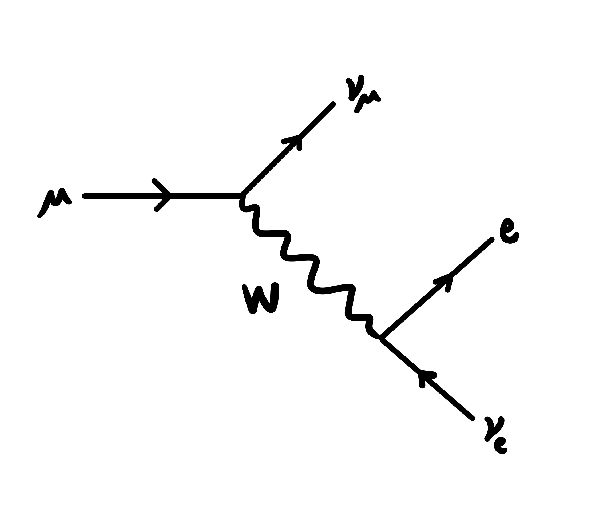

# Particle Physics
### the context on the successful yet incomplete theory from start to finish

## The Standard Model

In the late 1800s chemists were discovering and studying dozens of chemical elements. They slowly began to identify groups, then commonalities and patterns. Eventually this lead to the building the periodic table. They organized them by weight and valence charge which they realized were a result of these different elements being made up of different numbers of smaller pieces: protons and electrons (and neutrons too). All of the different elements they were discovering were really just different combinations of smaller particles. So in the 1900s when physicists were discovering new small particles and organizing them they took inspiration from the chemists a century earlier. They similarly realized these different particles they were discovering were really just combinations of smaller particles: quarks. They then organized these new smaller particles into our own table: the Standard Model.

### Quarks and Leptons

Here you should note our friend the electron, shown in green sitting with the other leptons. The electron is a fundamental particle (not made up of other particles) as far as we can tell. You should also note the lack of the proton. The same way you don't see water ($H_20$) on the periodic table, the proton won't appear on the Standard Model. A proton is made of two up quarks and one down quark (uud), similar to how Hydrogen is one proton and one electron. The proton is a composite particle (made of multiple fundamental particles). You can also build the dozens of other composite particles we know of using these quarks in either groups of two like the pion (ud) or three like the proton (uud).

Also note how we've only talked about the first column. For example it's not common to hear about the muon. There's a good reason for this. The muon has a lifetime on the order of a millionth of a second. This means if there's a muon hanging out in the universe if you check on it a few millionths of a second later you won't have a muon anymore, you'll have an electron. Crazy right! The universe can just decide to change that muon into an electron. It doesn't break any rules. The universe wants to do this because the muon is 200x heavier than the electron and the universe likes to relax down to the lowest energy state. Think of how much harder it is to hold a bowling ball at arms length as compared to a penny. The universe is lazy, so if it is allowed to make its life easier it will. So a muon will decay down into an electron pretty quickly. Even better if you have a tau, the electron's cousin that is 2000x heavier than it, who will live less than a trillinth of a second. The universe doesn't like holding a teenager at arms length. This rule goes for all the particles in the Standard Model. That's why you've heard of a proton but you probably haven't heard much about the sigma particle (uus), the protons heavier and therefore shortly lived cousin. Or why I'll talk about the pion (ud) and not the kaon (us). 

When talking about these kinds of decays, particle physicists like speaking in terms of a special kind of diagram called Feynman Diagrams. Below is the Feynman Diagram of the muon decaying to an electron (and releasing some neutrinos in the process)

  

We read these diagrams from left to right, where the initial particle (the muon) is on the left, and the final state particles (the electron and neutrinos) are on the right.

### Bosons

Now in this diagram you'll notice the little squiggle in the middle labeled as W. This is one of our five bosons, the W boson (cleverly named, I know). Bosons are known as "force carriers". It's super weird to think of a force as a particle because you can't hold a force in your hand despite the fact that some of the bosons have mass. So its best to think of these particles as the mediators of forces. So if an electrically charged particle wants to bump into another electrically charged particle, the photon (the carrier of the electromagnetic force, and yes also the particle of light) will help them with that. If an up quark wants to stick to a down quark inside of a pion, the gluon (the strong nuclear force mediator) will glue them together. And finally if a muon wants to decay to an electron (and two neutrinos) or if a proton inside the nucelus of a Uranium atom wants to decay into a neutron (also known as radioactivity), the W (or Z) will help with that. 

We have three fundamental forces in the Standard Model: the electromagentic force ($\gamma$), the strong nuclear force (g), and the weak nuclear force (W and Z). 

Again, note the absence of gravity (and the graviton, G). Also note the lonely, yellow scalar boson the Higgs. This one isn't associated with one of the fundamental forces, but instead one role of the Higgs is to give particles (including itself) mass. Crazy, I know. I won't elaborate on the Higgs Mechanism here, but feel free to look it up or ask me, its pretty cool. The Higgs might also have other secret jobs, so stay tuned for that in how the Higgs might play a role in [my analysis](../MyAnalysis/Analysis.md).

All of this information can be neatly (though intimidatingly) summarized in one, long, beautiful equation:

  

Held inside is the masses, charges, and interactions of every particle. Much less pretty than the table version I must say. It may not be pretty, but this equations describes the most successful theory ever. Take that Newton.

### Neutrinos

And just for completeness (and because they're super cool) let's talk briefly about the last row of leptons: neutrinos.

Neutrinos are the lightest massive particles in the Standard Model, probably a few hundred times lighter than the electron. They have no electric charge and barely even interact with matter at all. Physicists like to quote the fact that if you shot a neutrino through solid lead until it finally bumped into something it would travel freely for an entire lightyear before finally interacting. That's a quarter of the way to the nearest star to Earth (aka a long long way).

This obviously then makes neutrinos hard to detect since they just pass right through most material without leaving a trace. So hard to detect in fact particle physicists are still just guessing at their mass (see the less than symbol in the Standard Model). So unfortunately at experiments like [CMS](CMS.md) neutrinos are not detected directly. Instead they are just called missing energy. For example, if you see a muon decay into an electron you will have a bit of missing energy. It is that missing stuff that we "identify" as neutrinos. But don't worry, other experiments are designed to actually see neutrinos. 

As a final note for neutrinos lets talk about the three types, called flavors. You'll note that each lepton (electron, muon, and tau) has its own flavor of neutrino. This is because each lepton is only ever seen along side its flavor neutrino. You can see this in the Feynman Diagram above. The line of the muon only ever touches the muon neutrino (and the W boson), and same is for the electron and it's neutrino. If we ever saw a muon neutrino connected to an electron this would be "flavor violation" and would be a super cool sign of new physics! But no such luck.

You'll also note that the masses of the neutrinos (or at least our guesses at their masses) scale in a similar way to the leptons, with the electron neutrino being the lightest, then muon, then tau. And as we have discussed this means the tau neutrino can decay down into a muon neutrino which decay down into an electron neutrino. 

Now here's the awful(ly fun) part. An electron neutrino can also decay UP into a muon neutrino, or even up into a tau! And the best part? Its not even mediated by a boson! It just does it! WHAT!

Neutrinos are probably my favorite particle for this reason. This is called "neutrino oscillation" or "flavor mixing" and is one of the coolest mechanisms in particle physics. It's the only reason we know neutrinos have mass, and one of the few reasons we have a guess at what that mass is. But sadly CMS is not sensitive to this, so I'll leave that there for now.

### Antimatter

It is also important that I touch on one of the most interestingly named concepts: antimatter. Though it sounds like science fiction, antimatter is very real and very important. 
Antimatter is an umbrella term, so lets start with an example. Our friend the electron was officially discovered in 1897. About 30 years later, with the development of Quantum Mechanics, it was theorized that an exact copy of the electron but with a positive charge instead of negative could exist. And just four years later it was found: the positron. An exact copy of the electron but with opposite charge, the positron proved the existence of antimatter. But this isn't restricted just to electrons. Every fundamental particle has an antimatter partner. In fact you could make a whole Anti-Standard Model if you wanted to. All you have to do is flip the sign on the charge and boom, an anti-muon. Or an anti-up quark. Even an anti-tau neutrino. 

In typical notation, antimatter is denoted with a bar above it. For example a generic quark is often denoted with a simple q while an antiquark is denoted with $\\bar{q}$. You will also often note that antimatter in Feynman diagrams will have its arrow traveling backwards to remind you it's not like other girls (aka matter).

Now probably the coolest thing about antimatter is how it interacts with matter. If you have a ball of electrons in your right hand and you bring it into contact with an equal sized ball of positrons, both balls will completely annihilate each other, and you will get an explosion of energy. We will talk about this more in the next section. 

Now if you're not already asking this question let me pose something to you. Since everything about an electron and a positron (and all matter-antimatter pairs for that matter (or antimatter, pun intended)) is exactly the same except the charge, the universe is just as likely to produce a positron as it is an electron. And since they interact with the universe in the same way, and often get produced together, there would hypothetically be the same amount of positrons as electrons in the universe. If the positron is an exact copy of the electron with only the charge flipped - thus its mass, lifetime, and interactions with other matter are the same - why aren't there atoms like anti-carbon made up of anti electrons with anti-nuclei made up of anti-protons and anti-neutrons? There is theoretically nothing stopping these things from forming since anti-carbon's constituents would interact the same way as carbon's do. So why is there no anti-carbon floating around? Now we remember that if this hypothetical anti-carbon did exists and it ran into a normal carbon they would annihilate. So then maybe the real question is this: if all matter and antimatter is equally likely to exist, why is all of our matter just made up of one kind? And maybe even one better, why does the universe not completely annihilate itself?

This is one of the largest looming questions in physics. What is the reason for the matter-antimatter asymmetry? Was there an inequality at the start of the universe? Is there some small inequality that breaks the rules we know about that could allow for more matter than antimatter to survive? Stay tuned. We don't yet know.

  

## A Tiny Bit of Relativity

Now let's keep the going with the parallels to chemistry. In chemistry you'll often see something like this:

$$2H_2 + O_2 \rightarrow 2H_2O$$

where you don't change the number of H's nor the number of O's. You started with 2 * 2 = 4 H's and 1 * 2 = 2 O's and you ended with the same 2 * 2 = 4 H's and 2 * 1 = 2 O's. Effectively you're just moving the protons and electrons from place to the other, conserving things like mass.

In particle physics we have different rules. Most notably, we don't need to conserve mass.

Einstein told us this is in probably the most famous equation ever. But what does it mean?

$$E = mc^2$$

Let's day I have a ball of stuff that has a mass of 10. I could do some stuff to make two things of mass 5, no worries. More excitingly, if I can find a way to completely annihilate that ball of stuff I can get an energy of 10 from it leaving no mass behind (no mass can be weird to think of, so try and think of light which carries energy but has no mass). A perfect example of this is the electron-positron annihilation mentioned in the previous section. If I bring an electron into contact with a positron they will completely annihilate each other and we will be left with just energy (a photon, aka light). And that energy will be exactly the combination of the masses of the two particles I just annihilated, aka twice the mass of an electron. Here's what that looks like in a Feynman Diagram.

*insert electron-positron annihilation Feynman Diagram here

We can go vise versa too! If I have an energy of 10 from that I can make a ball of mass of 10. OR. I can make 2 balls of 5. Or 10 balls of 1. In more physical terms if I have an energy of twice the mass of the electron I can MAKE an electron-positron pair! Just like that! Just read the above Feynman Diagram backwards and you'll see that process in action.

But mass is not something that needs to be conserved in particle physics. Only energy needs to be conserved. Mass is just a way to store energy, the same way that raising the bowling ball off the ground gives it energy and when you release it that energy can be converted into kinetic energy (energy of motion, another way the universe can store energy).

This is very powerful. If I have a ball of mass of 10 that is stationary I can only make stuff that is 10 or less. BUT. If I get that ball of mass 10 moving at an energy of 5 I can then make something of mass 15! Remember, mass is just stored energy the same way that movement is stored energy. If I get that same ball of mass moving at an energy of 90 I can make something 10x heavier than the thing I am using to make it!

This is the idea behind particle accelerators like the [LHC](LHC.md)!

 

## A Tiny Bit of Quantum Mechanics

Now before I shuffle you off to the [LHC](LHC.md) and [CMS](CMS.md) pages and onto [My Analysis](../MyAnalysis/Analysis.md) we need to talk briefly about Quantum Mechanics.

Quantum Mechanics (and Quantum Field Theory) are the language of the Standard Model. Quantum Mechanics writes the rule book for how matter behaves, especially down at the smallest scale (aka the scale at which we are talking), and its cardinal rule is that the universe is probabilistic.

In chemistry, when you take hydrogen and oxygen and some energy you can predict exactly what your output will be. In quantum physics, if you collide a quark with an anti-quark and check what the output is you will get a different answer every time. Not only because you have every option available to you, but because each of those options has a different liklihood of happening. Instead of being able to tell you what will happen, physicists are able to tell you the probabilities of each outcome. Quantum Mechanics is able to predict these probabilities straight from the Standard Model.

This "probability of an outcome" in physics is called a cross section. And in particle physics the unit of this probability is called barns. Yes, like the red building storing hay. Think of the cross section as the area of a target you're trying to hit with a baseball from 100 meters away. If you are throwing a ball at one barn, you might hit it. If you're throwing the ball at something the area of 10 barns you dang well shouldn't miss. And if you're throwing it at one trillionth of a barn (a picobarn, the usual scale on which we work), you might need a billion or so tries. 

This same logic applies to the collisions at the LHC. If we are to go looking for a process whose cross section (liklihood of happening) is once in every 75 quadrillion, we should probably try a lot of times. Colliders like the [LHC](LHC.md) are production machines, and give physicists a HUGE pile of hay to go looking for their preferred needle.

